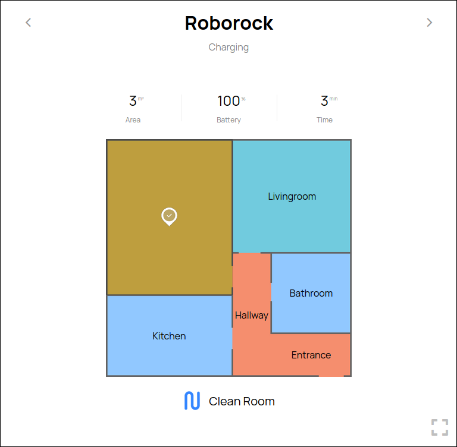
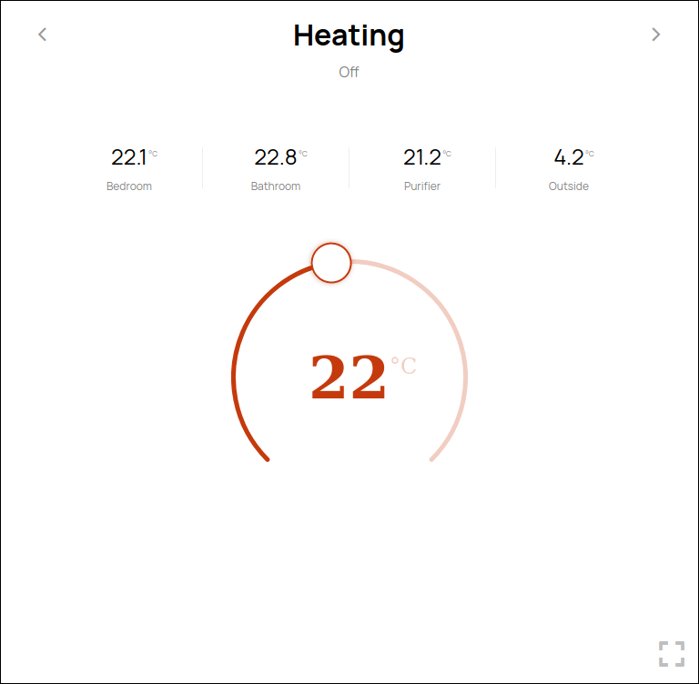
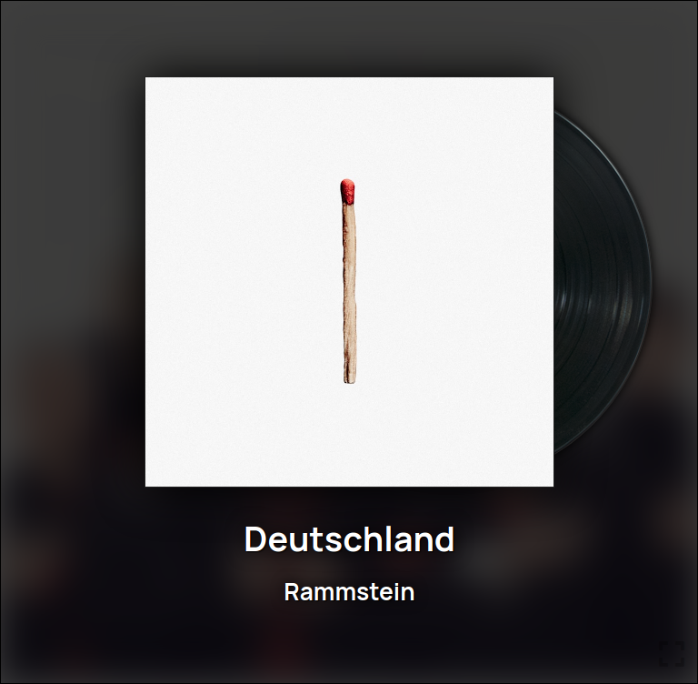
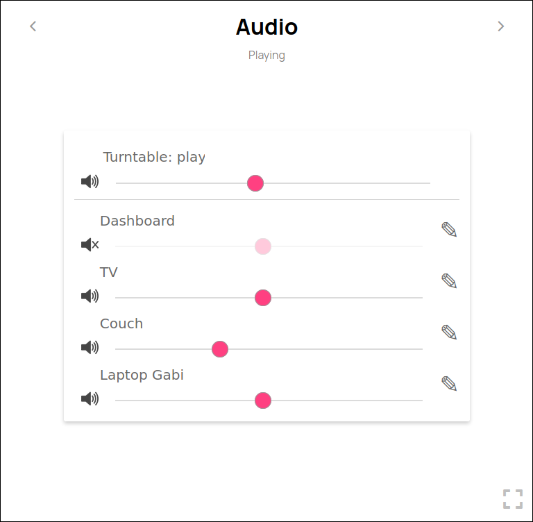

# smart-home

A Docker image meant to connect and automate smart devices in a house.

--------------------------------------------------------------------------------

### Dashboard screenshots

--------------------------------------------------------------------------------

### Supported stuff

- Zigbee2MQTT
- Bluetooth detection
- HTTP incoming webhooks
- Tasmota sockets
- Yeelight WIFI bulbs
- WakeOnLan
- XBOX controllers
- CEC
- Roborock vacuum cleaners
- Xiaomi purifiers
- Audio-Technica USB Turntables (AT-LP120XBT-USB)
- Snapcast

Probably more but that's what I thought of really quick.

--------------------------------------------------------------------------------

### Languages & Advantages

It's mainly written in `PHP`, `YAML`, `BASH` and it also has a few modules written in `GO`.

I'm saying it's also written in `YAML` because one of the advantages of this app is that you don't have to know PHP or the source code to create your automation. You can script everything through `YAML` configs: initiate devices from existing templates, create event triggers, functions and crons or even create new device templates.

Another great advantage over other automation apps is that it's language agnostic. So you can create modules/services written in about any language you want and then integrate them through `YAML` configs.

--------------------------------------------------------------------------------

### Rewrite in Go

PHP was a good option when I had a single smart bulb but things escalated so quickly. Now PHP is resource hungry and buggy since it's not built to run indefinitely.

I already started rewriting the project in golang but it will take a while.

--------------------------------------------------------------------------------

### Description

This description is quite incomplete but I'll update it once the projects reaches a relatively stable version.
